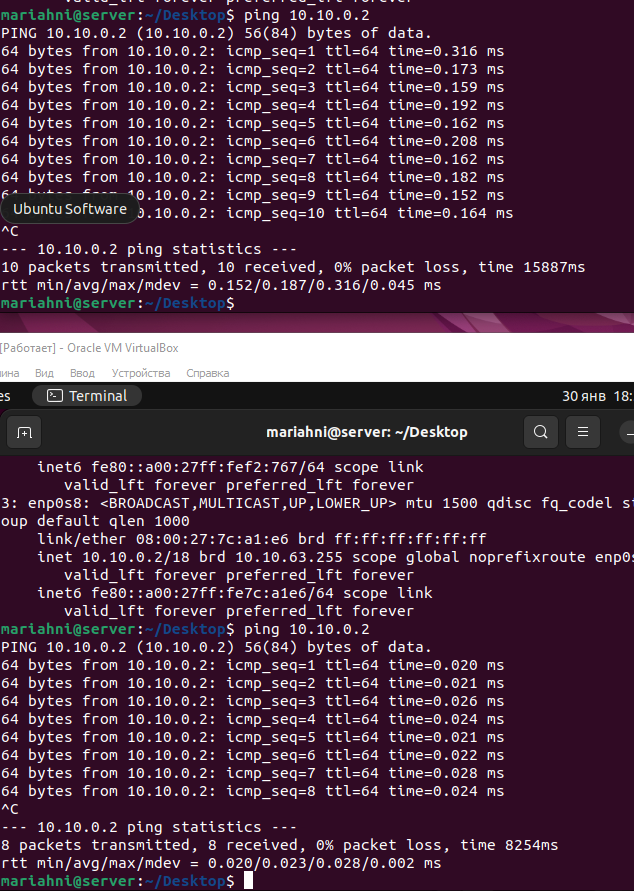

## Contents

   3.1. [Настройка gitlab-runner](#part-1-настройка-gitlab-runner)  
   3.2. [Сборка](#part-2-сборка)  
   3.3. [Тест кодстайла](#part-3-тест-кодстайла)   
   3.4. [Интеграционные тесты](#part-4-интеграционные-тесты)  
   3.5. [Этап деплоя](#part-5-этап-деплоя)  
   3.6. [Дополнительно. Уведомления](#part-6-дополнительно-уведомления)

### Part 1. Настройка **gitlab-runner**

`-` Раз ты решил заняться CI/CD, должно быть, ты очень-очень любишь тестировать. Я тоже это люблю. Так что приступим. Если тебе потребуется какая-либо информация, рекомендую искать ответы в официальной документации.

**== Задание ==**

##### Подними виртуальную машину *Ubuntu Server 22.04 LTS*.
*Будь готов, что в конце проекта нужно будет сохранить дамп образа виртуальной машины.*

##### Скачай и установи на виртуальную машину **gitlab-runner**.

##### Запусти **gitlab-runner** и зарегистрируй его для использования в текущем проекте (*DO6_CICD*).
- Для регистрации понадобятся URL и токен, которые можно получить на страничке задания на платформе.

### Part 2. Сборка

`-` Предыдущее испытание было создано, чтобы повышать в людях уверенность в себе.
Теперь я подкорректировала тесты, сделав их более сложными и менее льстивыми.

**== Задание ==**

#### Напиши этап для **CI** по сборке приложений из проекта *C2_SimpleBashUtils*.

##### В файле _gitlab-ci.yml_ добавь этап запуска сборки через мейк файл из проекта _C2_.

##### Файлы, полученные после сборки (артефакты), сохрани в произвольную директорию со сроком хранения 30 дней.

### Part 3. Тест кодстайла

`-` Поздравляю, ты выполнил абсолютно бессмысленную задачу. Шучу. Она была нужна для перехода ко всем последующим.

**== Задание ==**

#### Напиши этап для **CI**, который запускает скрипт кодстайла (*clang-format*).

##### Если кодстайл не прошел, то «зафейли» пайплайн.
##### В пайплайне отобрази вывод утилиты *clang-format*.

### Part 4. Интеграционные тесты

`-` Отлично, тест на кодстайл написан. [ТИШЕ] Говорю с тобой тет-а-тет. Не говори ничего коллегам. Между нами: ты справляешься очень хорошо. [ГРОМЧЕ] Переходим к написанию интеграционных тестов.

**== Задание ==**

#### Напиши этап для **CI**, который запускает твои интеграционные тесты из того же проекта.
##### Запусти этот этап автоматически только при условии, если сборка и тест кодстайла прошли успешно.
##### Если тесты не прошли, то «зафейли» пайплайн.

##### В пайплайне отобрази вывод, что интеграционные тесты успешно прошли / провалились.

### Part 5. Этап деплоя

`-` Для завершения этого задания ты должен перенести исполняемые файлы на другую виртуальную машину, которая будет играть роль продакшна. Удачи.

**== Задание ==**

##### Подними вторую виртуальную машину *Ubuntu Server 22.04 LTS*.
#### Напиши этап для **CD**, который «разворачивает» проект на другой виртуальной машине.

##### Запусти этот этап вручную при условии, что все предыдущие этапы прошли успешно.
##### Напиши bash-скрипт, который при помощи **ssh** и **scp** копирует файлы, полученные после сборки (артефакты), в директорию */usr/local/bin* второй виртуальной машины.
*Тут тебе могут помочь знания, полученные в проекте DO2_LinuxNetwork.*
- Будь готов объяснить по скрипту, как происходит перенос.
##### В файле _gitlab-ci.yml_ добавь этап запуска написанного скрипта.

##### В случае ошибки «зафейли» пайплайн.
В результате ты должен получить готовые к работе приложения из проекта *C2_SimpleBashUtils* (s21_cat и s21_grep) на второй виртуальной машине.
##### Сохрани дампы образов виртуальных машин.
**P.S. Ни в коем случае не сохраняй дампы в гит!**
- Не забудь запустить пайплайн с последним коммитом в репозитории.

#### Создаём скрипт copy.sh, который будет передавать файлы через ssh, с помощью утилиты scp (копирование файлов через ssh)

#### Создадим пользователя gitlab-runner sudo su - gitlab-runner, сгенерируем и скопируем его ssh на вторую машину

#### Выдадим права на второй машине, для папки /usr/local/bin/

#### manual включение deploy

#### deploy "застрял"

### Part 6. Дополнительно. Уведомления

`-` Здесь написано, что твое следующее задание выполняется специально для нобелевских лауреатов. Здесь не сказано, за что они получили премию, но точно не за умение работать с **gitlab-runner**.

**== Задание ==**

##### Настрой уведомления о успешном/неуспешном выполнении пайплайна через бота с именем «[твой nickname] DO6 CI/CD» в *Telegram*.
- Текст уведомления должен содержать информацию об успешности прохождения как этапа **CI**, так и этапа **CD**.
- В остальном текст уведомления может быть произвольным.